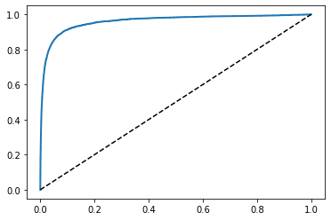

Let's load the MNIST data set for digits:


```python
from sklearn.datasets import fetch_openml
mnist = fetch_openml("mnist_784", version = 1)
mnist.keys()

```


    dict_keys(['data', 'target', 'frame', 'categories', 'feature_names', 'target_names', 'DESCR', 'details', 'url'])


Formatting the data from mnist:


```python
X, y = mnist["data"], mnist["target"]
print(X.shape)
print(y.shape)
```

    (70000, 784)
    (70000,)
    


```python
import matplotlib as mpl
import matplotlib.pyplot as plt
 
some_digit = X[0]
some_digit_image = some_digit.reshape(28,28)

plt.imshow(some_digit_image, cmap = "binary")
plt.axis("off")
plt.show()
```


    

    


It looks like a 5, but let's check its label:


```python
y[0]
```


    '5'


Let's convert the labels to integers:


```python
import numpy as np

y = y.astype(np.uint8)
```

Now we split the dataset into training sets and data sets: (Mnist dataset already comes properly formatted for this with 60000/10000)


```python
X_train, X_test, y_train, y_test = X[:60000], X[60000:], y[:60000], y[60000:]
```

# Training a Binary Classifier


```python
from sklearn.linear_model import SGDClassifier

y_train_5 = (y_train == 5)
y_test_5 = (y_test == 5)

sgd_clf = SGDClassifier(random_state = 42)
sgd_clf.fit(X_train, y_train_5)

sgd_clf.predict([some_digit])

```


    array([ True])


# Performance Measures

## Implementing cross validation


```python
from sklearn.model_selection import StratifiedKFold
from sklearn.base import clone

skfolds = StratifiedKFold(n_splits=3)

for train_index, test_index in skfolds.split(X_train, y_train_5):
    clone_clf = clone(sgd_clf)
    X_train_folds = X_train[train_index]
    y_train_folds = y_train_5[train_index]
    X_test_fold = X_train[test_index]
    y_test_fold = y_train_5[test_index]
    
    clone_clf.fit(X_train_folds, y_train_folds)
    y_pred = clone_clf.predict(X_test_fold)
    n_correct = sum(y_pred == y_test_fold)
    print(n_correct/ len(y_pred))
```

    0.95035
    0.96035
    0.9604
    


```python
from sklearn.model_selection import cross_val_score
cross_val_score(sgd_clf, X_train, y_train, cv = 3, scoring = "accuracy")
```


    array([0.87365, 0.85835, 0.8689 ])


# Confusion Matrix


```python
from sklearn.model_selection import cross_val_predict

y_train_pred = cross_val_predict(sgd_clf, X_train, y_train_5, cv = 3)

from sklearn.metrics import confusion_matrix

confusion_matrix(y_train_5, y_train_pred)
```


    array([[53892,   687],
           [ 1891,  3530]], dtype=int64)


The accuracy of positive predictions, called the **precision** of the classifier is given by:

precision = $\frac{TP}{TP+FP}$, where TP is the number of True positives and FP is the number of false positives

In this case, the precision of our classification is $\frac{3530}{687+3530} \approx 0.837 $

Precision is typically used along with another metric named **recall**, also called **sentsitivity** or **true positive rate**(TPR) is the retio of positive instances that are correctly detected by the classifier:

recall = $\frac{TP}{TP+FN}$, FN is of course the number of false negatives.

In this case, the recall is $\frac{3530}{3530+1891} \approx 0.651$

# Precision and Recall


```python
from sklearn.metrics import precision_score, recall_score
precision_score(y_train_5, y_train_pred)

```


    0.8370879772350012


```python
recall_score(y_train_5, y_train_pred)
```


    0.6511713705958311


It is convenient to to combine precision and recall into a single metric called the **F1 score**. The F1 score is the harmonic mean of precision and recall. (Regular mean treats all values uniformly whereas harmonic mean gives much more weight to the low values). The classifier will only get a high F1 score if both recall and precision are high.

F1 = $\frac{2}{\frac{1}{precision} + \frac{1}{recall}} = 2*\frac{precision *recall}{precision+recall} = \frac{TP}{TP+\frac{FN+FP}{2}}$


```python
from sklearn.metrics import f1_score
f1_score(y_train_5, y_train_pred)
```


    0.7325171197343846


The f1 score favors classifiers that have similar precision and recall which isn't always ideal. In some contexts, a high precision is wanted and in others a high recall is wanted.

Increasing precision reduces recall, and vice-versa. It is called the **precision/recall trade off**.


```python
y_scores = cross_val_predict(sgd_clf, X_train, y_train_5, cv = 3, method ="decision_function")
from sklearn.metrics import precision_recall_curve

precisions,recalls, thresholds = precision_recall_curve(y_train_5, y_scores)

def plot_precision_recall_vs_threshold(precisions, recalls, thresholds):
    plt.plot(thresholds, precisions[:-1], "b--", label = "Precision")
    plt.plot(thresholds, recalls[:-1], "g-", label = "Recall")
    [...]

plot_precision_recall_vs_threshold(precisions, recalls, thresholds)
plt.show()    
```


    

    


```python
threshold_90_precision = thresholds[np.argmax(precisions >= 0.90)]
print(threshold_90_precision)
```

    3370.0194991439557
    


```python
y_train_pred_90 = (y_scores >= threshold_90_precision)
precision_score(y_train_5, y_train_pred_90)

```


    0.9000345901072293


```python
recall_score(y_train_5, y_train_pred_90)
```


    0.4799852425751706


# The ROC Curve


```python
from sklearn.metrics import roc_curve

fpr, tpr, thresholds = roc_curve(y_train_5, y_scores)

def plot_roc_curve(fpr, tpr, label = None):
    plt.plot(fpr,tpr, linewidth = 2, label=label)
    plt.plot([0,1], [0,1], 'k--')
    [...]

plot_roc_curve(fpr,tpr)
plt.show()
```


    

    


The **ROC curve** is another common tool used with binary classifiers. It is very similar to the precision/recall curve, but instead of plotting precision versus recall, the ROC curve plots the **the true positive rate**(recall) againts the **false positive rate** (FPR). 

The FPR is the ratio of negative instances that are incorrectly classified as positive. It is equal to 1 - true negative rate (TNR), which is the ratio of negative instances that are correctly classified as negative. TNR is also called **specificity**. 

ROC curve plots **sensitivity**(recall) versus 1-specificity. 

We can also compare classifiers by measuring the area under the curve (AUC). A perfect classifier will have a ROC AUC equal to 1, while a true random one will have a ROC AUC of 0.5.


```python
from sklearn.metrics import roc_auc_score
roc_auc_score(y_train_5, y_scores)

```


    0.9604938554008616


### choosing PR versus ROC

- You should choose the precision/recall curve to evaluate the model when the instance of your positive class is rare.
- You should choose the precision/recall curve when you care more about false positives than false negatives.
- In any other case, you should use the receiving operator curve.

## Random Forest Classifier

Let's compare the SGD classifier to the Random Forest Classifier


```python
from sklearn.ensemble import RandomForestClassifier

forest_clf = RandomForestClassifier(random_state = 42)
y_probas_forest = cross_val_predict(forest_clf, X_train, y_train_5, cv = 3, method = "predict_proba")

```


```python
y_scores_forest = y_probas_forest[:,1]
fpr_forest, tpr_forest, thresholds_forest = roc_curve(y_train_5, y_scores_forest)

plt.plot(fpr, tpr, "b:", label = "SGD")
plot_roc_curve(fpr_forest, tpr_forest, "Random Forest")
plt.legend(loc = "lower right")
plt.show()
```


    

    


```python
roc_auc_score(y_train_5, y_scores_forest)
```


    0.9983436731328145


# Multiclass Classification

One strategy is to use multiple binary classifiers and choose the one with the highest decision score. This is sometimes called an **OvR**(One versus Rest) strategy or one versus all strategy.

Another strategy is to train a classifier for every pair of digits, e.g. 0 versus 1, 0 versus 2, ... 0 versus 9, 1 versus 2, ... 8 versus 9.

This is called the **OvO**(one versus one) strategy. If there are N classes, the there are $\frac{N \times (N-1)}{2}$ classifiers to train, or in our case 45 classifiers to train.

- Some algorithms scale poorly with size of training set so having many smaller OvO training sets is better
- But for most binary classifiers OvR is generally preffered

Let's try Support Vector Machine classifier:


```python
from sklearn.svm import SVC

svm_clf = SVC()
svm_clf.fit(X_train, y_train)
svm_clf.predict([some_digit])
```


    array([5], dtype=uint8)


```python
some_digit_scores = svm_clf.decision_function([some_digit])
some_digit_scores
```


    array([[ 1.72501977,  2.72809088,  7.2510018 ,  8.3076379 , -0.31087254,
             9.3132482 ,  1.70975103,  2.76765202,  6.23049537,  4.84771048]])


```python
np.argmax(some_digit_scores)
```


    5


```python
svm_clf.classes_
```


    array([0, 1, 2, 3, 4, 5, 6, 7, 8, 9], dtype=uint8)


```python
svm_clf.classes_[5]
```


    5


When a classifier is trained it stores the list of target classes in its classes_ attribute. In this case the index and class match, but this won't always be the case.

If we want to force Scikit-Learn to use OvO or OvR, we can use OneVsOneClassifier or OneVsRestClassifier classes:


```python
from sklearn.multiclass import OneVsRestClassifier
over_clf = OneVsRestClassifier(SVC())
over_clf.fit(X_train, y_train)
over_clf.predict([some_digit])
```


    array([5], dtype=uint8)


```python
len(over_clf.estimators_)
```


    10


```python
sgd_clf.fit(X_train, y_train)
sgd_clf.predict([some_digit])
```


    array([3], dtype=uint8)


```python
sgd_clf.decision_function([some_digit])
```


    array([[-31893.03095419, -34419.69069632,  -9530.63950739,
              1823.73154031, -22320.14822878,  -1385.80478895,
            -26188.91070951, -16147.51323997,  -4604.35491274,
            -12050.767298  ]])


```python
cross_val_score(sgd_clf, X_train, y_train, cv = 3, scoring = "accuracy")

```


    array([0.87365, 0.85835, 0.8689 ])


```python
from sklearn.preprocessing import StandardScaler

scaler = StandardScaler()
X_train_scaled = scaler.fit_transform(X_train.astype(np.float64))
cross_val_score(sgd_clf, X_train_scaled, y_train, cv = 3, scoring = "accuracy")
```


    array([0.8983, 0.891 , 0.9018])


# Error Analysis


```python
y_train_pred = cross_val_predict(sgd_clf, X_train_scaled, y_train, cv = 3)
conf_mx = confusion_matrix(y_train, y_train_pred)
conf_mx
```


    array([[5577,    0,   22,    5,    8,   43,   36,    6,  225,    1],
           [   0, 6400,   37,   24,    4,   44,    4,    7,  212,   10],
           [  27,   27, 5220,   92,   73,   27,   67,   36,  378,   11],
           [  22,   17,  117, 5227,    2,  203,   27,   40,  403,   73],
           [  12,   14,   41,    9, 5182,   12,   34,   27,  347,  164],
           [  27,   15,   30,  168,   53, 4444,   75,   14,  535,   60],
           [  30,   15,   42,    3,   44,   97, 5552,    3,  131,    1],
           [  21,   10,   51,   30,   49,   12,    3, 5684,  195,  210],
           [  17,   63,   48,   86,    3,  126,   25,   10, 5429,   44],
           [  25,   18,   30,   64,  118,   36,    1,  179,  371, 5107]],
          dtype=int64)


```python
plt.matshow(conf_mx, cmap = plt.cm.gray)
plt.show()
```


    

    


```python
row_sums = conf_mx.sum(axis = 1, keepdims = True)
norm_conf_mx = conf_mx/row_sums

np.fill_diagonal(norm_conf_mx, 0)
plt.matshow(norm_conf_mx, cmap= plt.cm.gray)
plt.show()
```


    

    


The rows above represent ther actual classes while the columns represent the predicted classes.

We can also directly plot the images of the data that is failing a lot of the tests, to gain a better idea why are model is failing on those particular images.


```python
def plot_digits(instances, images_per_row=10, **options):
    size = 28
    images_per_row = min(len(instances), images_per_row)
    images = [instance.reshape(size,size) for instance in instances]
    n_rows = (len(instances) - 1) // images_per_row + 1
    row_images = []
    n_empty = n_rows * images_per_row - len(instances)
    images.append(np.zeros((size, size * n_empty)))
    for row in range(n_rows):
        rimages = images[row * images_per_row : (row + 1) * images_per_row]
        row_images.append(np.concatenate(rimages, axis=1))
    image = np.concatenate(row_images, axis=0)
    plt.imshow(image, cmap = mpl.cm.binary, **options)
    plt.axis("off")
    
cl_a,cl_b = 3,5
X_aa = X_train[(y_train == cl_a) & (y_train_pred == cl_a)]
X_ab = X_train[(y_train == cl_a) & (y_train_pred == cl_b)]
X_ba = X_train[(y_train == cl_b) & (y_train_pred == cl_a)]
X_bb = X_train[(y_train == cl_b) & (y_train_pred == cl_b)]
plt.figure(figsize=(8,8))
plt.subplot(221); plot_digits(X_aa[:25], images_per_row = 5)
plt.subplot(222); plot_digits(X_ab[:25], images_per_row = 5)
plt.subplot(223); plot_digits(X_ba[:25], images_per_row = 5)
plt.subplot(224); plot_digits(X_bb[:25], images_per_row = 5)
plt.show()
```


    

    


# Multilabel Classification

Our classifiers currently only output a single class. Sometimes, we want to output multiple classes.


```python

```
